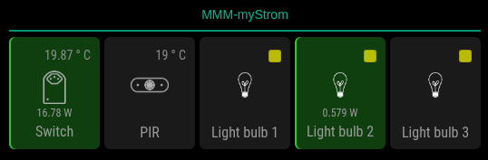
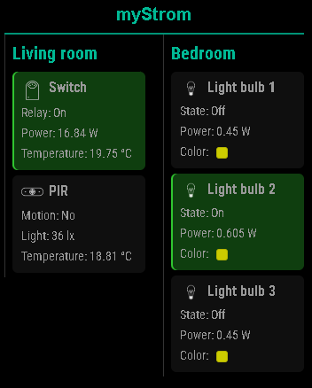

# MMM-myStrom
This is a module for the [MagicMirror²](https://github.com/MagicMirrorOrg/MagicMirror).
It displays status and data from [myStrom](https://mystrom.ch/) devices (PIR, Switch, Bulb).

# Features
- Automatic device type detection (PIR / Switch / Bulb)
    - PIR vlaues: Motion (YES/NO), Ambient light (lx), Room temperature (°C)
    - Switch values: Relay ON/OFF, Power usage (W), Room temperature (°C)
    - Bulb values: On/off state, Power, Light color
- Multi-room layouts: `column` (hierarchical), `showRoomSideBySide`, `inline` (compact grid) and `light`
- Per-type update interval settings
- Error & loading handling
- Multi-language support: i18n for EN, DE, FR, IT


## Screenshot
c






## Installation

### Install

To install this module, navigate into `~/MagicMirror/modules` and type the following commands:

```bash
git clone https://github.com/ch1ledbe/MMM-myStrom
cd ~/MagicMirror/modules/MMM-myStrom
npm install
```

## Configuration

To use this module, you have to add a configuration object to the modules array in the `config/config.js` file.

### Example configuration

Minimal configuration to use the module:

```js
    {
        module: "MMM-myStrom",
        position: "bottom_center",
        config: {
            devices: [
                {
                    room: "Room 1",
                    devices: [
                        { name: "Device 1", ip: "192.168.1.11" },
                    ]
                }
            ]
        }
    },
```

Configuration with all options:

```js
    {
        module: "MMM-myStrom",
        position: "bottom_center",
        config: {
            layout: "column",
            showRoomSideBySide: false,
            displayMode: "light",
            PIRUpdateInterval: 30000,
            SwitchUpdateInterval: 2000,
            BulbUpdateInterval: 2000,
            devices: [
                {
                    room: "Room 1",
                    devices: [
                        { name: "Device 1", ip: "192.168.1.11" },
                        { name: "Device 2", ip: "192.168.1.12" }
                    ]
                },
                {
                    room: "Room 2",
                    devices: [
                        { name: "Device 1", ip: "192.168.1.14" },
                        { name: "Device 2", ip: "192.168.1.15" },
                        { name: "Device 3", ip: "192.168.1.16" }
                    ]
                }
            ]
        }
    },

```

### Configuration options

|Option|Possible values|Default|Description
|------|------|------|-----------
| `layout`|`"inline"`/`"column"`|`"column"`| Horizontal and vertical alignment
| `showRoomSideBySide`|`"false"` / `"true"`|`"false"`| Shows rooms side by side in vertical alignmnet 
| `displayMode`|`"light"`|not configured|*Optional* Simplified view of all devices
| `PIRUpdateInterval`|`>=2000` (ms)|`30000` (ms) | Update interval for motion detectors (2 seconds and more recommended)
| `SwitchUpdateInterval`|`>=2000` (ms)|`2000` (ms) | Update interval for switch devices (2 seconds and more recommended)
| `BulbUpdateInterval`|`>=2000` (ms)|`2000` (ms) | Update interval for bulbs (2 seconds and more recommended)
| `devices`|as many devices and rooms as you want|see sample configuration|You can add unlimited devices to each room and create as many rooms as you need.

## License

This project is licensed under the MIT License - see the [LICENSE](LICENSE.md) file for details.

## Changelog

All notable changes to this project will be documented in the [CHANGELOG.md](CHANGELOG.md) file.
